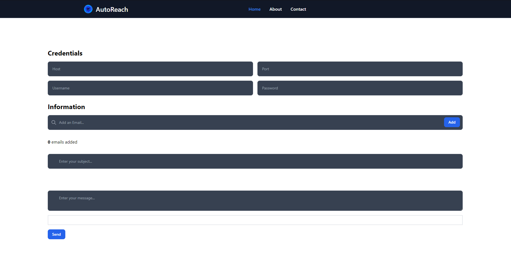

# AutoReach

[](https://github.com/FujiwaraChoki/autoreach/blob/master/LICENSE)
[](https://github.com/FujiwaraChoki/autoreach/issues)
[](https://github.com/FujiwaraChoki/autoreach/stargazers)

[](https://autoreach.vercel.app/)

AutoReach is an innovative app developed with Next.js that makes E-Mail Marketing and Outreach
easier than ever before.

## Features

- **Scrapers**: Powerful scraping tools to gather data from various sources and extract valuable insights.
- **AI Chatbots**: Intelligent chatbots for automating customer support, answering FAQs, and providing personalized assistance 24/7.
- **Custom Software**: Customized software solutions tailored to address specific business challenges and streamline operations.

## Getting Started

### Prerequisites

Make sure you have the following software installed:

- Node.js (version 12 or above)
- npm (version 6 or above)

### Installation

1. Clone the repository:

    ```shell
    git clone https://github.com/FujiwaraChoki/autoreach.git
    ```

2. Navigate to the project directory:

    ```shell
    cd autoreach
    ```

3. Install the dependencies:

    ```shell
    npm install
    ```

### Usage

1. Start the development server:

    ```shell
    npm run dev
    ```

2. Open [http://localhost:3000](http://localhost:3000) in your browser.

## Built With

- [Next.js](https://nextjs.org/) - The React framework for production.
- [Tailwind CSS](https://tailwindcss.com/) - A utility-first CSS framework for rapidly building custom designs.

## Authors

- **Sami Hindi** - [FujiwaraChoki](https://www.samihindi.com/)
